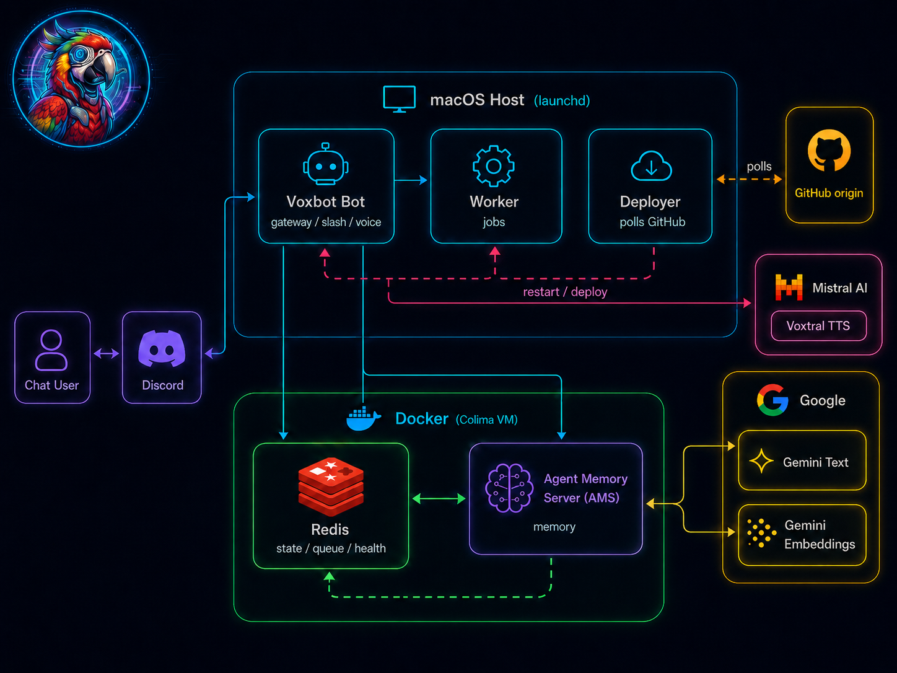
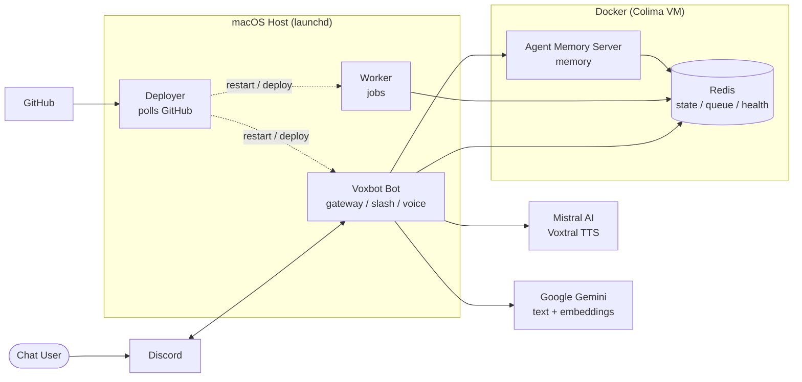
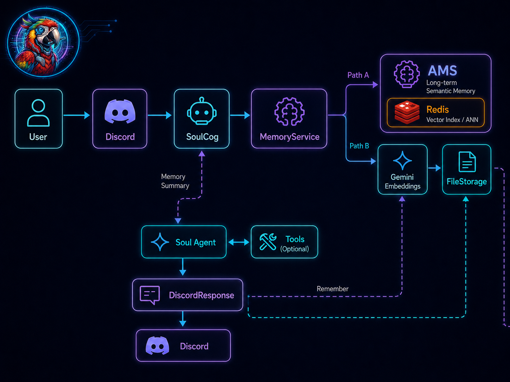
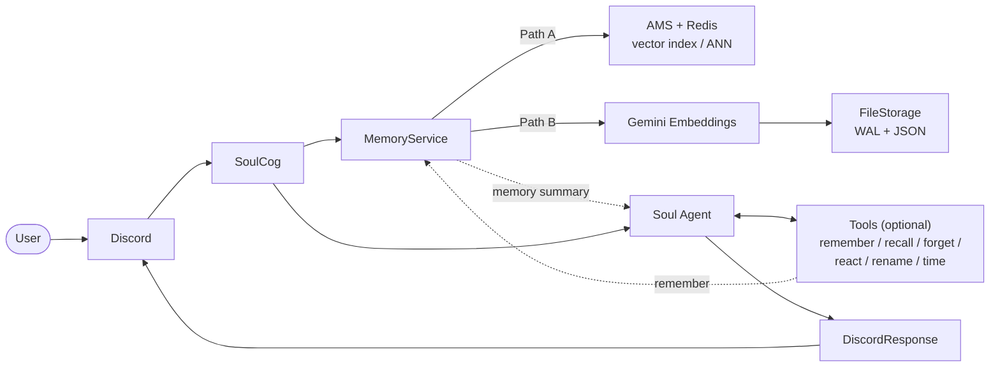
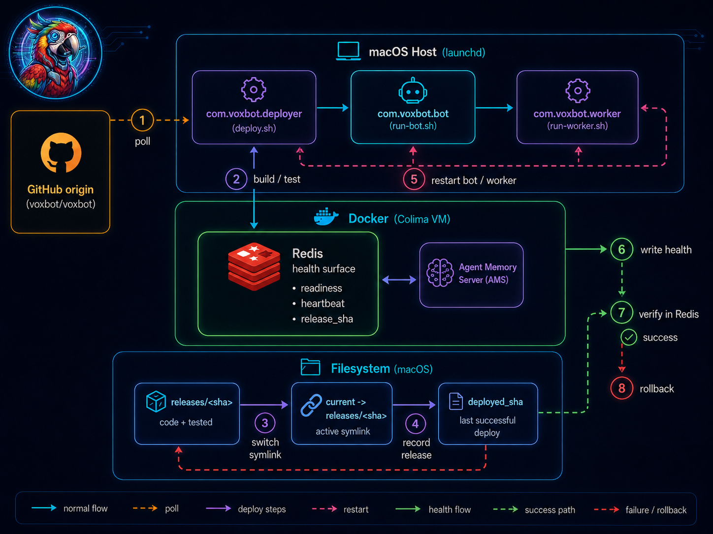
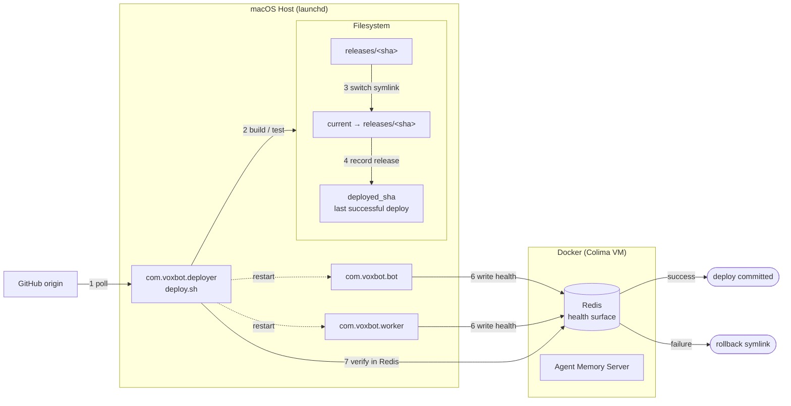

# Voxbot Architecture

Discord bot. Bot + Worker on macOS host (launchd). Redis + Agent Memory Server in Docker. Soul plugin = pydantic-ai agent with semantic memory.

For deploy mechanics see [deploy/macos/ARCHITECTURE.md](../deploy/macos/ARCHITECTURE.md).

---

## General Architecture

Two Python processes (bot, worker). Three containers (redis, agent-memory-api, agent-memory-worker). Owner-only secrets in `/Users/voxbot/secrets/voxbot.env`.

---

## Soul — Memory Recall & Storage

Backend chosen by `SOUL_MEMORY_BACKEND`: `redis` → AMS, `json` → FileStorage. Partition = Discord user id. Embedding = `gemini-embedding-2` (3072d); local hash fallback if API fails.

---

## Process Durability

Steps: poll → build/test → swap `current` → record `release_sha` → kill bot+worker (launchd respawns) → bot writes health to Redis → deployer verifies → commit `deployed_sha` or roll symlink back. Failed releases are deleted.

---

## User Eligibility

Single-tenant, owner-centric. No role tables.

| Tier | Detected by | Can do |
|---|---|---|
| **Owner** | `author.id == BOT_OWNER_ID` | Soul DMs, `/admin health`, `/admin restart`, receives tracebacks |
| **Whitelisted channel member** | `channel.id in SOUL_CHANNEL_IDS` | Talk to Soul, accumulate memory, `/voice`, `/health` |
| **Other guild member** | anywhere else | `/voice`, `/health` only |
| **Outsider** | DM, not owner | ignored |

Gates: `plugins/soul/cog.py:48` (whitelist), `checks.py:10` (`is_bot_admin`).

---

## File Index

| Concern | Path |
|---|---|
| Entry / CLI | `src/voxbot/__main__.py` |
| Bot class + plugin loader | `src/voxbot/bot.py` |
| Settings | `src/voxbot/settings.py` |
| Soul listener | `src/voxbot/plugins/soul/cog.py` |
| Soul agent + tools | `src/voxbot/plugins/soul/ai.py` |
| Soul prompt | `src/voxbot/plugins/soul/prompts/personality.mdc` |
| Memory service | `src/voxbot/plugins/soul/memory.py` |
| Storage (File / AMS) | `src/voxbot/plugins/soul/storage.py` |
| Embeddings | `src/voxbot/plugins/soul/embedding.py` |
| Periodic identity job | `src/voxbot/plugins/soul/jobs.py` |
| Health runtime | `src/voxbot/runtime/health.py` |
| Docket runtime | `src/voxbot/runtime/docket.py` |
| Deploy runbook | `deploy/macos/README.md` |
| Deploy rationale | `deploy/macos/ARCHITECTURE.md` |
| Docker infra | `deploy/macos/infra/compose.yaml` |
| CI | `.github/workflows/verify.yml` |
